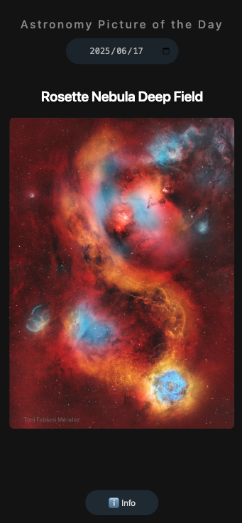
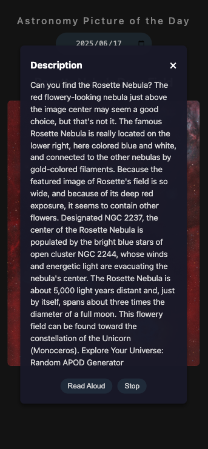

## 課題 No.5 JS5 - WEB API 活用アプリ

## タイトル

Astronomy Picture of the Day（NASA API）

## 概要

この Web アプリケーションは、NASA の APOD（Astronomy Picture of the Day）API を活用して、毎日異なる天文学関連の画像や動画を表示するアプリです。画像や動画のタイトル、説明文を表示し、説明文を読み上げる機能を実装しました。

## 工夫した点

- スマートフォンでの使用を前提にしました。毎日異なる画像サイズに対応するため、画面タップで Info ボタンを表示・非表示にすることで、画面のスペースを有効活用しました。
- Web Speech API を活用した説明文の読み上げ機能を実装しました。

## 難しかった点・課題

- Info ボタンの表示・非表示の切り替えが不安定で、日付選択時にも反応してしまう問題があるため、改善が必要。
- 説明文を日本語に翻訳する機能を追加したい。

## 画面イメージ

